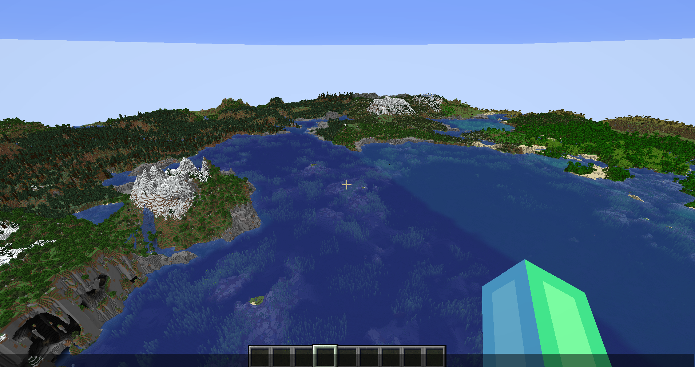

:::severe

As usual, backups are **absolutely mandatory!**

:::

Hello, hello! It's update day! Thank you to everyone who worked on this update, tested
things, reported bugs, etc. This update is a big one!

## Overview

In general, not much changed with Canvas besides a *lot* of bug fixes. BUT we do have
some fun new features we are planning to roll out soon! For starters, we've been
working internally on a "VVD" system, which is sorta like a fake chunk system that lets
the server extend its view distance at a lower resource cost. This is still in testing
and needs more polish before it's merged into the 26.3 branch, though. Here is a
picture of what that looks like in-game so far:

:::note

The distance you see here is roughly 120 chunks of VVD and 8 chunks of normal
view distance on the server, with the client at a 128-chunk render distance.

<small>Please do not ever set your VVD distance this high...</small>

:::

Pretty crazy, yeah?

We are also looking to rewrite and polish a lot of the region threading patch. Given
that we are no longer upstreaming from Folia, we plan to revamp and polish the core
region threading patch wholesale, making it more efficient, cleaner, and more
flexible. One of the first things we will be doing is a general code cleanup, which
will consist only of formatting consistency changes, since Folia's and Canvas' code
formats differ in a few ways.

The next thing we will be doing is reworking the portal handling logic a bit. We're
not rewriting it wholesale, but rather modifying the system to be more flexible and
extensible, instead of having methods hundreds of lines long in a single class
handling everything. We primarily want to do this in preparation for Minecraft's new
dimension, The Sift. With these changes, we will be able to add support for that
portal more easily, since the system will generally be a bit more flexible and
abstract.

## Bugs Fixed

Canvas 26.3 introduces a **ton** of bug fixes for *both* Folia and Canvas:
- General 26.3 update fixes. Dueris did research prior to the update to discern what
  needed changing. This helped reduce the number of bugs found by a *TON*. Includes:
  - Thread check post effects implementation & new API
  - Move the randomstate garbage collection to the global tick
  - Add `CommandResponseTracker` types to the `ACE` command framework we built
    - We also modified the `CommandResponseTracker` class to be thread-safe for
      future-proofing; however, we use the `ACE` API in its place for all usages
  - Replace the server schedule call with an entity scheduler call in
    `ServerCommandSuggestionsProvider#trySchedule`
  - Thread check `LivingEntity#startSleeping`
  - Make the `PlayerList#playerPermissions` field a CHM. It has no usages, but was
    changed to future-proof it
  - Properly handle `canRandomlyTeleportTo` to prevent ever randomly teleporting out
    of region
  - Regionize the `posteffects` command
  - Update the player placement logic for placing in a new region to include resending
    post effects, matching Vanilla
  - Replace the `Entity#teleportToPortalDestination` body with a `USO` throw
    - This is a newly added method that extracts some code already replaced in Folia,
      letting spectators click portals to go through them. The caller that handles
      spectators has also been rewritten to be properly threaded.
- (*Folia fix*) Fix inventory holders with viewing players being unloaded, causing
  off-region viewers to trip thread checks
- (*Canvas fix*) If a plugin changes the teleport destination via our API, we now
  update whether the target is in the same region
- Log the game profile name in entity context checks
- (*Folia fix*) Close inventories and stop trading on common teleport
- (*Folia fix*) Autosave command storage
- (*Folia fix*) Autosave maps properly
- Apply an initial offset to world autosave points to spread the autosaves over the
  interval, rather than running them all at once
- (*Folia/Canvas fix*) Restore the `SERVER` data accessor in the `data` command
- (*Folia fix*) Purge the function conditional from the `execute` command
- (*Folia fix*) Fix thread violation in `OwnerHurtByTargetGoal`
- (*Folia fix*) Fix and limit the `execute` command to be safer for region threading
- Refactor scheduler lifecycle
- (*Folia fix*) Reimplement debug subscribers
- (*Folia fix*) Restore tick time sampling for clients using the TPS graph in F3
- (*Folia fix*) Fix the wrong value being passed into the target buffer
  - Note: while this is technically unused, it's best to fix it anyway in case
    *something* uses it down the line
- (*Folia fix*) Fix region threading issues with certain packets
  - `ServerboundSetStructureBlockPacket` when the position is out of region
  - `ServerboundSetTestBlockPacket` when the position is out of region
  - `ServerboundTestInstanceBlockActionPacket` when the position is out of region
  - `ServerboundSetJigsawBlockPacket` when the position is out of region
  - `ServerboundBlockEntityTagQueryPacket` when the block entity is out of region
  - `ServerboundEntityTagQueryPacket` when the entity is out of region
  - `ServerboundSignUpdatePacket` when the sign position is out of region
- (*Folia fix*) Fix all Minecraft debug commands
- (*Folia fix*) Fix `PlayerBucketEmptyEvent` threading issue
- (*Folia fix*) Fix `BlockLockCheckEvent` threading issue
- (*Folia fix*) Make `MobGoalHelper.GENERIC_TYPE_CACHE` a CHM
- (*Folia fix*) Make `CraftSoundGroup.SOUND_GROUPS` a CHM
- (*Folia/Canvas fix*) Make `CraftPlayer#getPluginWeakReference` synchronized
- (*Folia fix*) Fix dolphins trying to add effects to off-region players

It is worth noting that a *lot* of these apply to 26.2, and we will release a backport
update with many of the applicable fixes sometime in the future.

## Changes for server owners
- The ranged-attack config was renamed and now affects all ranged mobs.
- `filter-move-packets` and our `MC-298464` fix were removed.
- `autosave-command-storage` now exists. Command storage and maps now save properly,
  and each world's autosave is now offset so they don't all save at once.
- The `execute` command is a bit more limited now.
  - There is a new Canvas-exclusive conditional, `regionof`, so you can execute
    things like `/execute if regionof <entity or columnpos>...`
- The `compute` command (introduced in 26.3) is disabled, and `posteffect` has been
  added and properly implemented for region threading.

## Changes for plugin developers
- The `TeleportType` has been removed from the `TeleportAsync` events.
- A new alternative API is available for `getRespawnLocation`: `getRespawnLocationAsync`.
  - This was created because verifying the respawn position is not safe for region
    threading when the position is out of region, so we have added this API for
    plugin developers to receive a `CompletableFuture` that provides the respawn
    location with optional verification.

---

Thank you very much to everyone who helped with this update. We at CanvasMC hope you
enjoy the new update. Happy crafting!

:::info

Download 26.3 at our [downloads page](https://canvasmc.io/downloads/canvas)

:::

*- The CanvasMC Team*